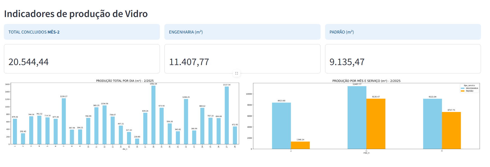

# Dashboard de Produção Industrial

Este projeto envolve a criação de um dashboard para prever a compra de material e estoque minimo.
A análise é segmentada por mês, permitindo identificar tendências de produção.
Com base nesses dados, foram feitas previsões.




### Objetivo do Projeto

O objetivo principal deste projeto é criar um dasboard que forneça os numeos de produção por mês e por serviço.

1. **Qual o total de produção por mês?**
2. **Qual o total de produção por situação?**
3. **Qual a qantidade prevista de vender no próximo mês?**
4. **Qual Estoque necessário "IDEAL" para o próximo mês?**

### ** Tecnologias e Ferramentas Usadas no Projeto**  

1. **[Python](https://www.python.org/)** → Linguagem principal do projeto.  
2. **[Streamlit](https://streamlit.io/)** → Framework para criar dashboards e aplicativos interativos.  
3. **[Pandas](https://pandas.pydata.org/)** → Manipulação e análise de dados.  
4. **[Matplotlib](https://matplotlib.org/)** → Geração de gráficos.  
5. **[Seaborn](https://seaborn.pydata.org/)** → Visualização de dados estatísticos.  
6. **[Plotly](https://plotly.com/python/)** → Gráficos interativos.  
7. **[Numpy](https://numpy.org/)** → Cálculos numéricos e manipulação de arrays.  
8. **[Openpyxl](https://openpyxl.readthedocs.io/)** → Leitura e escrita de arquivos Excel (.xlsx).  
9. **[Datetime](https://docs.python.org/3/library/datetime.html)** → Manipulação de datas e horários.  
10. **[OS (Módulo do Python)](https://docs.python.org/3/library/os.html)** → Gerenciamento de diretórios e arquivos.  

## Funcionalidades

- **Página Inicial**: Apresenta totais e gráficos principais da produção filtrados por mês e ano.
- **Configuração**:
  - Definição de indicadores de meta.
  - Salvamento da meta praticada.
- **Gráficos**:
  - Produção mensal.
  - Entrada de pedidos vs. produção do forno.
  - Produção do forno por mês.
  - Tipos de vidro produzidos mensalmente.
- **Previsão (BETA)**: Projeção de vendas e estoque baseada em dados históricos disponíveis.
- **Ordem de Produção**: Permite montar a programação da fábrica seguindo conceitos de rota e/ou data.

## Tecnologias Utilizadas

- [Streamlit](https://streamlit.io/)
- Python
- Bibliotecas para análise de dados e visualização

## Instalação

1. Clone o repositório:

   ```bash
   git clone https://github.com/jeferson-souzap/Analise_producao_streamlit.git
   ```

2. Navegue até o diretório do projeto:

   ```bash
   cd Analise_producao_streamlit
   ```

3. Crie um ambiente virtual (opcional, mas recomendado):

   ```bash
   python -m venv venv
   source venv/bin/activate  # No Windows: venv\Scripts\activate
   ```

4. Instale as dependências:

   ```bash
   pip install -r requeriment.txt
   ```

## Uso

Para iniciar a aplicação:

```bash
streamlit run Home.py
```
